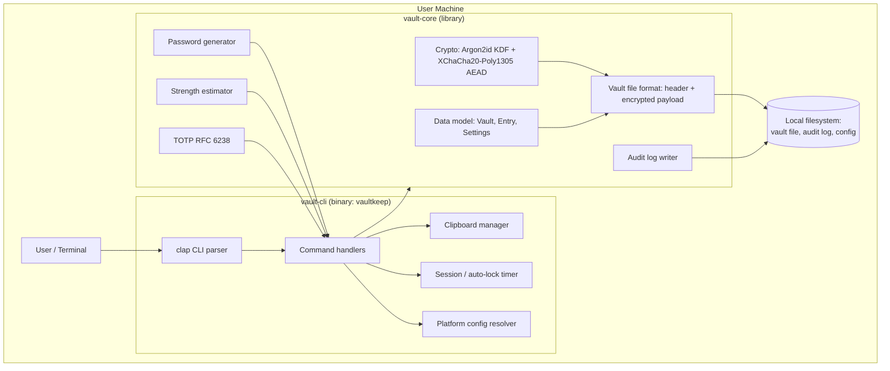
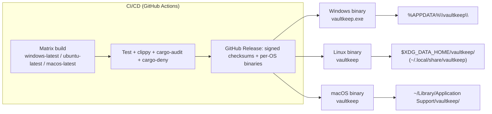

# Phase 2 — Architecture & Planning

**Project:** Vaultkeep
**Scope:** Local-only, single-user, cross-platform (Windows/Linux/macOS) CLI password/secret manager.

## 2.1 Functional Requirements (FR)

| ID | Requirement |
|---|---|
| FR-1 | User can initialize a new vault protected by a master password. |
| FR-2 | User can optionally bind a vault to a keyfile as a second unlock factor. |
| FR-3 | User can create, read, update, delete secret entries (title, username, password, URL, notes, tags, custom fields, TOTP seed). |
| FR-4 | User can generate cryptographically strong passwords with configurable policy (length, character classes). |
| FR-5 | User can list and search entries without ever exposing secret values unintentionally. |
| FR-6 | User can copy a secret to the clipboard with automatic clearing after a timeout. |
| FR-7 | User can view/compute current TOTP codes for entries that carry a TOTP seed. |
| FR-8 | User can change the master password / rotate the vault key without losing entries. |
| FR-9 | User can export an encrypted backup and import/restore it. |
| FR-10 | User can review a local audit trail of vault operations. |
| FR-11 | User can run an interactive session ("shell") that auto-locks after inactivity. |
| FR-12 | System evaluates password strength and flags reused/weak/old passwords. |

## 2.2 Non-Functional Requirements (NFR)

| ID | Requirement | Target |
|---|---|---|
| NFR-1 | Confidentiality of vault contents at rest | AEAD-encrypted, KDF-derived key, no plaintext ever written to disk |
| NFR-2 | No network I/O in default code path | Enforced by dependency choice + CI check (no networking crate in the default feature set) |
| NFR-3 | Cross-platform parity | Identical behavior on Windows 10+/Linux (glibc ≥2.31)/macOS 12+, verified by CI matrix |
| NFR-4 | Unlock latency | Argon2id tuned to ~500 ms–1.5 s on a typical 2020s laptop core |
| NFR-5 | Cold start (non-crypto commands) | < 200 ms |
| NFR-6 | Availability of the user's data | Vault file corruption must be detectable (AEAD tag) and backups restorable; no single bit-flip should be silently accepted |
| NFR-7 | Maintainability | ≥ 80% line coverage on `vault-core`; `clippy -D warnings` clean; documented public API |
| NFR-8 | Auditability | Every state-changing operation logged locally with timestamp + operation + entry UUID (never secret values or titles) |
| NFR-9 | Recoverability | Documented backup/restore and disaster-recovery procedure (see [09-performance-and-reliability.md](09-performance-and-reliability.md)) |

## 2.3 High-Level Design (HLD)

Vaultkeep is a **single-process, local-only CLI application** built as a Cargo workspace with a
clean split between the security-critical core library (no CLI/IO concerns) and the CLI shell
(user interaction, terminal I/O, clipboard, process lifecycle). This separation exists so that
`vault-core` can later be reused by a GUI (Tauri) or a sync daemon without carrying CLI
dependencies, and so that `vault-core` alone is the unit of focused security review.



**Key architectural decisions**

1. **No background daemon by default.** Each CLI invocation opens the vault, performs one
   operation, zeroizes key material, and exits. This minimizes the window during which key
   material lives in memory and removes an entire class of IPC/daemon attack surface. The
   optional `vaultkeep shell` command trades some of that isolation for convenience and is
   documented as a distinct, opt-in trust boundary with its own inactivity auto-lock (FR-11).
2. **Core has zero network dependencies.** `vault-core` will not link any HTTP/TLS/socket crate.
   This is enforced both by code review and by a CI dependency-tree check (Phase 10) so the
   "offline-only" claim in the threat model is verifiable, not just asserted.
3. **Versioned, self-describing file format.** The vault header carries format version and KDF
   parameters in the clear (they must be, to derive the key) but is authenticated as AEAD
   associated data, so tampering with parameters is detected rather than silently accepted.
4. **Fail closed.** Any decryption failure, tag mismatch, or format error refuses to open the
   vault and never falls back to a weaker mode.

## 2.4 Low-Level Design (LLD) — Module Breakdown

```
vaultkeep/
├── crates/
│   ├── vault-core/            # security-critical, no direct terminal/IO side effects beyond fs
│   │   ├── src/crypto.rs      # KDF, AEAD, key types (Zeroizing<[u8;32]>), constant-time compare
│   │   ├── src/format.rs      # header (de)serialization, file read/write, atomic-write-and-rename
│   │   ├── src/model.rs       # Vault, Entry, Settings, PasswordHistoryItem (serde)
│   │   ├── src/store.rs       # VaultStore: create/open/save/rekey — orchestrates the above
│   │   ├── src/generator.rs   # CSPRNG password generator (policy-driven)
│   │   ├── src/strength.rs    # entropy estimate + common-password/blocklist + reuse check
│   │   ├── src/totp.rs        # RFC 6238 TOTP code generation
│   │   ├── src/audit.rs       # append-only local audit log (entry UUIDs only, no secrets)
│   │   ├── src/paths.rs       # OS-default vault/audit-log paths — shared by every front end
│   │   └── src/error.rs       # VaultError — deliberately low-information Display impl
│   └── vault-cli/             # user-facing binary: `vaultkeep`
│       ├── src/main.rs        # clap derive CLI, dispatch table
│       ├── src/commands/*.rs  # init, add, get, edit, remove, list, search, generate, totp,
│       │                      # passwd, export, import, audit_log, check, shell, completions
│       ├── src/clipboard.rs   # arboard wrapper + hash-guarded auto-clear
│       ├── src/session.rs     # in-memory unlocked session + idle watchdog thread (shell mode)
│       ├── src/config.rs      # thin wrapper over vault_core::paths
│       └── tests/cli.rs       # integration tests (assert_cmd against the real vaultkeep binary)
├── apps/
│   └── vault-gui/             # desktop GUI (Tauri 2), reuses vault-core unchanged — see docs/13-gui.md
│       ├── src/main.rs, commands.rs, state.rs   # Tauri command handlers + session state
│       └── ui/                # plain HTML/CSS/vanilla JS frontend, no build step
├── .github/workflows/         # CI/CD (Phase 10)
└── docs/                      # this documentation set
```

### 2.4.1 Vault file format (binary envelope)

```
┌─────────────────────────────── Header (cleartext, authenticated as AEAD AAD) ───────────────────────────────┐
│ magic: b"VKLT"      (4 bytes)                                                                                │
│ format_version: u16                                                                                          │
│ kdf_id: u8            (1 = Argon2id)                                                                         │
│ kdf_salt: [u8; 16]    (CSPRNG, unique per vault)                                                             │
│ kdf_m_cost_kib: u32   (default 262144 = 256 MiB)                                                             │
│ kdf_t_cost: u32       (default 3)                                                                            │
│ kdf_p_cost: u32       (default 1)                                                                            │
│ keyfile_bound: u8     (0/1)                                                                                  │
│ aead_id: u8           (1 = XChaCha20-Poly1305)                                                               │
│ nonce: [u8; 24]       (CSPRNG, unique per write)                                                             │
│ header_crc: u32       (corruption sanity check, NOT a security control)                                     │
└────────────────────────────────────────────────────────────────────────────────────────────────────────────┘
┌────────────────────────────── Ciphertext (AEAD(key, nonce, plaintext, aad=header)) ──────────────────────────┐
│ plaintext = postcard-serialized VaultPayload { schema_version, entries: Vec<Entry>, settings: Settings }      │
│ AEAD tag appended by the cipher (16 bytes), verified before any plaintext is trusted                        │
└────────────────────────────────────────────────────────────────────────────────────────────────────────────┘
```

Writes are **atomic**: the new content is written to `vault.tmp`, `fsync`'d, then renamed over
the vault file (rename is atomic on all three target platforms' local filesystems), so a crash
mid-write cannot corrupt the previous good vault.

### 2.4.2 Data model

```rust
struct Entry {
    id: Uuid,
    title: String,
    username: Option<String>,
    password: SecretBox<str>,          // zeroized on drop
    url: Option<String>,
    notes: Option<String>,
    tags: Vec<String>,
    totp_seed: Option<SecretBox<str>>, // base32 seed, zeroized on drop
    custom_fields: Vec<(String, SecretBox<str>)>,
    password_history: Vec<HistoricalPassword>,
    created_at: DateTime<Utc>,
    updated_at: DateTime<Utc>,
}

struct HistoricalPassword { value: SecretBox<str>, replaced_at: DateTime<Utc> }

struct Settings {
    kdf_params: KdfParams,
    clipboard_clear_seconds: u32,   // default 20
    session_idle_timeout_seconds: u32, // default 300, shell mode only
    generator_defaults: GeneratorPolicy,
}
```

Full field/type reference: see [data-model.md](data-model.md).

### 2.4.3 Sequence — Unlock flow

```mermaid
sequenceDiagram
    participant U as User
    participant CLI as vault-cli
    participant Core as vault-core
    participant FS as Filesystem

    U->>CLI: vaultkeep get "github.com"
    CLI->>FS: read vault file
    FS-->>CLI: header + ciphertext
    CLI->>U: prompt master password (hidden input)
    U-->>CLI: password
    CLI->>Core: open(header, ciphertext, password, keyfile?)
    Core->>Core: Argon2id(password, salt, m/t/p) -> key (Zeroizing<[u8;32]>)
    Core->>Core: XChaCha20-Poly1305 decrypt(key, nonce, ciphertext, aad=header)
    alt tag verifies
        Core-->>CLI: decrypted Vault (in memory only)
        CLI->>Core: find entry "github.com"
        CLI->>CLI: copy password to clipboard (hash-tracked)
        CLI->>Core: audit.log(GET, entry.id)
        CLI->>Core: zeroize key + vault on scope exit
        CLI-->>U: "Copied to clipboard, clearing in 20s"
    else tag fails
        Core-->>CLI: VaultError::AuthenticationFailed
        CLI->>Core: audit.log(UNLOCK_FAILED)
        CLI-->>U: "Incorrect password or corrupted vault" (generic message)
    end
```

## 2.5 Security Architecture (summary — full detail in [05-security-hardening.md](05-security-hardening.md))

- **KDF:** Argon2id, default parameters m=256 MiB, t=3, p=1 (well above the OWASP *minimum*
  of m=19 MiB/t=2/p=1, chosen because this is a single interactive unlock, not a
  high-QPS server login — the cost is paid once per command, not amortized across millions of
  users). Parameters are stored per-vault and user-tunable via `vaultkeep init --kdf-profile`.
- **AEAD:** XChaCha20-Poly1305, 256-bit key, random 192-bit nonce per write, header bound as AAD.
- **Key handling:** derived key lives in `Zeroizing<[u8;32]>` / `secrecy::SecretBox`, never
  `Debug`/`Display`-printed (compile-time enforced by the wrapper types), zeroized on drop, and
  `mlock`(2)/`VirtualLock` used where the OS supports it to reduce swap exposure.
- **Password comparisons** (e.g., keyfile hash check) use constant-time equality.
- **Fail-closed error handling:** authentication failures return one generic error variant to
  the CLI layer; internal detail (which check failed) is only in structured debug logs gated
  behind an explicit `--debug` flag that never runs in the default path.
- **Second factor:** optional keyfile whose bytes are mixed into the Argon2id "secret" input,
  so possession of the keyfile is required in addition to the master password.
- **Audit log:** local, append-only, contains timestamps/operation/entry UUID only — never
  titles, usernames, passwords, or notes — so the log itself is low-sensitivity and does not
  need the same protection level as the vault, though it still gets restrictive file permissions.
- **Session auto-lock:** `vaultkeep shell` mode holds the derived key in memory and starts an
  idle-watchdog thread; after `session_idle_timeout_seconds` (default 300s) of no input, the
  session zeroizes its key and requires re-authentication.

## 2.6 API Design (CLI surface)

Vaultkeep has no network API in the MVP; the "API" is the CLI command surface plus the
`vault-core` public Rust API (for future GUI/embedding reuse). Full reference:
[cli-reference.md](cli-reference.md).

## 2.7 Deployment Architecture



There is no server component to deploy. Distribution is a signed, checksummed binary per
platform via GitHub Releases (package-manager formulas — winget/Homebrew/AUR — are a roadmap
item, see [12-production-readiness.md](12-production-readiness.md)). Each platform's per-user
application-data directory (resolved via the `directories` crate, matching OS conventions)
holds the vault file, the audit log, and a small non-secret config file (KDF profile defaults,
clipboard timeout, etc.) — never the master password itself.

## 2.8 Scalability, Observability, Backup/DR (summary)

- **Scalability:** single-user local data; the relevant "scale" axis is vault size (number of
  entries) and file size, not concurrent users. Tested up to 10,000 entries — see
  [09-performance-and-reliability.md](09-performance-and-reliability.md).
- **Observability:** structured, leveled logging via `tracing` to stderr (human) or JSON
  (`--log-format json`), with a hard rule that `Entry` secret fields never implement
  `tracing::Value`/`Debug` in a way that would print them (verified in Phase 7/8 tests).
- **Backup/DR:** `vaultkeep export` produces a re-encrypted, portable backup file; documented
  3-2-1 backup guidance and a step-by-step restore/DR runbook in
  [09-performance-and-reliability.md](09-performance-and-reliability.md).

See [03-threat-model.md](03-threat-model.md) for the accompanying STRIDE threat model and
[data-model.md](data-model.md) / [cli-reference.md](cli-reference.md) for full schema and
command reference.
