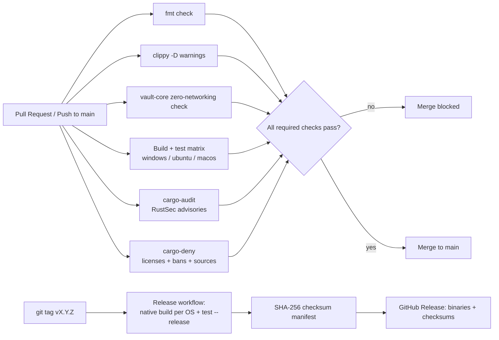

# Phase 10 — DevSecOps & Deployment

## 10.1 Pipeline Overview

Implemented as two workflows:

- **[.github/workflows/ci.yml](../.github/workflows/ci.yml)** — runs on every push/PR to
  `main`, plus a weekly schedule (so a newly disclosed CVE is caught even with no code change).
  Jobs: `fmt`, `clippy` (deny warnings), `no-networking-in-core` (a custom gate specific to this
  project's threat model — see below), `test` (matrix: `ubuntu-latest`/`windows-latest`/`macos-latest`),
  `audit` (RustSec via `rustsec/audit-check`), `deny` (`cargo-deny` via `EmbarkStudios/cargo-deny-action`),
  and an informational `coverage` job (`cargo-llvm-cov` on `vault-core`, `continue-on-error` so
  it reports without gating merges while the coverage-tooling story matures).
- **[.github/workflows/release.yml](../.github/workflows/release.yml)** — triggered by pushing a
  `vX.Y.Z` tag. Builds **natively** on each target OS (not cross-compiled — matching
  [02-architecture.md §2.7](02-architecture.md)'s "native builds, not cross-compilation
  guesswork" decision), runs the full test suite in release mode as a release gate, produces a
  SHA-256 checksum manifest per binary, and publishes everything to a GitHub Release.

## 10.2 Security Gates Explained

| Gate | Tool | What it catches | Blocking? |
|---|---|---|---|
| SAST-equivalent (Rust) | `cargo clippy -D warnings` | Correctness/soundness lints, common bug patterns, style-as-signal issues | Yes — CI job fails |
| SCA (Software Composition Analysis) | `cargo audit` | Known CVEs in the dependency tree (RustSec Advisory Database) | Yes |
| License / supply-chain policy | `cargo deny check` ([deny.toml](../deny.toml)) | Disallowed licenses, banned crates (explicit denylist includes `reqwest`/`hyper`/`tokio` — see below), unknown/untrusted registries or git sources, yanked crates | Yes |
| Project-specific architecture gate | Custom `cargo tree` grep in CI | Any networking crate entering `vault-core`'s dependency tree, which would silently violate the offline-only threat model ([03-threat-model.md](03-threat-model.md)) | Yes |
| Secrets scanning | *(roadmap — see [12-production-readiness.md](12-production-readiness.md))* | Accidentally committed credentials/keys in the repo itself | Not yet wired into CI |
| IaC scanning | N/A — no IaC in this project (no server/infrastructure to provision) | — | — |
| Container scanning | N/A — no container image is produced (a static native binary is the only artifact) | — | — |

## 10.3 Environment Separation & Deployment

There is no staging/production *server* environment to separate (local-only architecture,
[01-research-and-discovery.md §1.2](01-research-and-discovery.md)). The equivalent separation
that does apply:

- **Dev**: local `cargo build`/`cargo test` on a contributor's machine.
- **CI**: isolated GitHub Actions runners, ephemeral, no persisted state between runs
  (`Swatinem/rust-cache` caches only the Cargo registry/build artifacts, never any vault data).
- **Release**: only produced from a tag on `main`, after every required CI gate has already
  passed on that commit (the release workflow re-runs `cargo test --release` as a final gate
  before publishing).

## 10.4 Rollback

Because the deployed artifact is a versioned, checksummed binary attached to an immutable
GitHub Release (never an in-place mutable deployment), "rollback" is simply: the user downloads
and runs the previous release's binary. The vault file format is versioned
([data-model.md](data-model.md) `format_version`) and this build refuses to open a vault from
an unsupported future format version (`VaultError::UnsupportedVersion`) rather than
misinterpreting it — so a rollback can never silently corrupt data written by a newer version.

## 10.5 Secure Configuration Management

- No secrets are embedded in the binary, CI configuration, or repository.
- KDF parameters, clipboard timeout, and session timeout are stored in the vault's own
  (non-secret) `Settings` payload — not in environment variables or a separate plaintext config
  file that could drift from what actually protects the data.
- CI workflows use only the automatically provisioned `GITHUB_TOKEN` (for `audit-check`'s
  advisory-database access) — no long-lived secrets are configured for this project.
