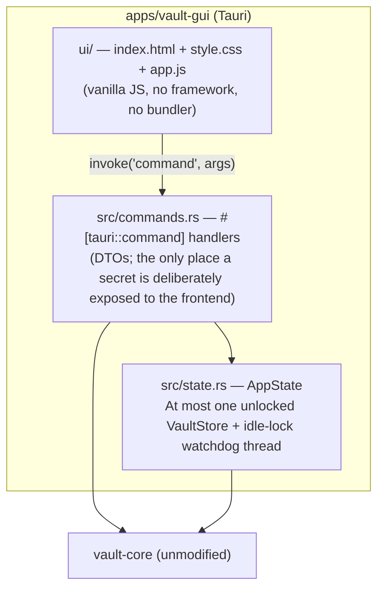

# The Vaultkeep GUI

**Status:** implemented, reuses `vault-core` unmodified. This document is the architecture and
design record for the desktop GUI, added after the CLI-only MVP described in
[01-research-and-discovery.md](01-research-and-discovery.md) — the scope decision there
explicitly deferred a GUI to "when needed"; this is that follow-up.

## Why this was straightforward

[02-architecture.md §2.3](02-architecture.md) split the project into `vault-core` (no CLI/IO
concerns) specifically so a GUI could be added later **without touching the security-critical
core at all**. That held: `apps/vault-gui` depends on `vault-core` exactly as `vault-cli` does,
and zero lines changed in `vault-core`'s crypto, format, or store modules to support it. The
only core change made *for the GUI* was moving OS-default-path resolution
([paths.rs](../crates/vault-core/src/paths.rs)) from `vault-cli` into `vault-core`, so the CLI
and GUI are provably resolving the same default vault location rather than two independent
implementations that could silently drift apart.

## Technology choice: Tauri 2

| Option considered | Why not |
|---|---|
| Electron | Bundles a full Chromium + Node runtime per app (100+ MB), a much larger attack surface, and pulls the project's frontend dependency graph into JavaScript-land in a way that doesn't fit a security-critical tool's minimal-dependency principle. |
| egui / iced (pure Rust immediate-mode GUI) | Avoids a webview entirely, but hand-building password-manager-grade forms/lists/modals in an immediate-mode framework is significantly more implementation effort for a "clean minimal" UI than plain HTML/CSS, for no security benefit here (the vault logic already lives in Rust regardless of UI toolkit). |
| **Tauri 2** | Rust backend (reuses `vault-core` directly, no FFI/serialization boundary crossing into another language), uses the **OS's already-installed webview** (WebView2 on Windows, WKWebView on macOS, WebKitGTK on Linux) instead of bundling a browser — small installers, and the frontend is deliberately plain HTML/CSS/vanilla JS with **no build step, no npm dependency tree**, calling Rust through Tauri's typed `invoke` bridge. |

## Architecture



**Session model.** A GUI window is inherently long-lived, unlike a one-shot CLI command — so the
GUI's trust model is the CLI's *`shell` mode*, not its default one-shot mode (see
[03-threat-model.md](03-threat-model.md) T14). `AppState` holds at most one unlocked
`VaultStore` behind a `Mutex`, and a background thread locks it (drops it, zeroizing the key and
releasing the vault's advisory file lock — the same mechanism as the CLI, [format.rs](../crates/vault-core/src/format.rs))
after 300 seconds of no command activity. The frontend polls `is_unlocked` every 5 seconds and
returns to the unlock screen the moment that happens — there is no separate GUI-specific
auto-lock mechanism to keep in sync with the CLI's.

**Secret exposure boundary.** Every Tauri command that returns entry data uses an explicit DTO
(`EntrySummaryDto` for lists/search — no field can hold a secret; `EntryDetailDto` for a single
opened entry — deliberately calls `.expose()`), mirroring the same "grep for `.expose()` to find
every place a secret escapes the vault" principle as [secret.rs](../crates/vault-core/src/secret.rs)
and the CLI's `EntrySummary` (see [05-security-hardening.md §5.2](05-security-hardening.md)).

**Master-password generator.** The create-vault form and the change-master-password modal both
offer a "⟳ Generate" button next to the master-password field, calling the same
`generate_password` command as the entry-password generator but with a fixed, deliberately
stronger default policy (24 chars, all character classes, CSPRNG-backed — see
[generator.rs](../crates/vault-core/src/generator.rs), current guidance per OWASP ASVS 5.0 V2.1 /
NIST SP 800-63B Appendix A). Because a master password is never written to the vault in any
recoverable form — unlike an entry's password, there is nothing to look up later — generating one
reveals it in the field (switches from `type="password"` to `type="text"`) with an explicit
warning and a one-click copy, rather than silently hiding it the way the entry-password generator
does. The CLI equivalent is `init --generate`/`passwd --generate`, which prints the generated
password once and requires an explicit "I have saved this" confirmation before proceeding — the
GUI relies on the visible warning + reveal instead of a blocking confirmation, since there is no
terminal-style modal prompt to gate on.

**Clipboard.** Uses the official `tauri-plugin-clipboard-manager`, with the exact same
hash/value-guarded auto-clear pattern as the CLI's [clipboard.rs](../crates/vault-cli/src/clipboard.rs):
the frontend remembers what it wrote and only clears the clipboard after 20 seconds if it still
holds that exact value, so a later manual copy by the user is never clobbered.

**Content Security Policy.** `tauri.conf.json` sets `default-src 'self'; script-src 'self'` —
the frontend loads only its own bundled `app.js`/`style.css`, no remote scripts, no inline
`<script>` blocks, consistent with the project's zero-network-calls-by-default posture (the GUI,
like the CLI, makes no network requests).

## What the GUI covers vs. the CLI

| Capability | CLI | GUI |
|---|---|---|
| Init / unlock / lock | ✅ | ✅ |
| CRUD entries, tags, notes, URL | ✅ | ✅ |
| Password generator (inline, configurable) | ✅ | ✅ |
| Generate a strong *master* password (create-vault / change-master-password) | ✅ (`init --generate`, `passwd --generate`) | ✅ ("⟳" next to the master-password field on the create-vault screen and the change-master-password modal) |
| Strength/reuse/staleness report | ✅ (`check`) | ✅ ("Check" panel) |
| TOTP code display + countdown | ✅ | ✅ (live-updating) |
| Change master password | ✅ (`passwd`) | ✅ |
| Local audit trail view | ✅ (`audit-log`) | ✅ ("Activity" panel) |
| Auto-lock on idle | ✅ (`shell` mode only) | ✅ (always — every GUI session) |
| Keyfile second factor | ✅ | Not yet — GUI always opens with password-only; scope-limited for the initial GUI release, tracked in [12-production-readiness.md](12-production-readiness.md) |
| Encrypted export/import, KDF profile selection, shell scripting (`--stdin`) | ✅ | Not yet — CLI-only for now, same roadmap tracking |

The CLI remains the full-capability, scriptable interface; the GUI covers the everyday
day-to-day workflow with the same underlying guarantees.

## Building

```
cargo tauri dev              # hot-reloading dev run (from apps/vault-gui)
cargo tauri build            # produces a native installer for the current OS
```

Requires the Tauri CLI (`cargo install tauri-cli --version "^2.0.0"`) and, per platform, the
same native toolchain Tauri itself documents (WebView2 runtime on Windows — present by default
on Windows 10 2004+/11; WebKitGTK dev packages on Linux; Xcode command line tools on macOS).
CI builds it natively per OS in the release pipeline — see
[10-devsecops-cicd.md](10-devsecops-cicd.md).
