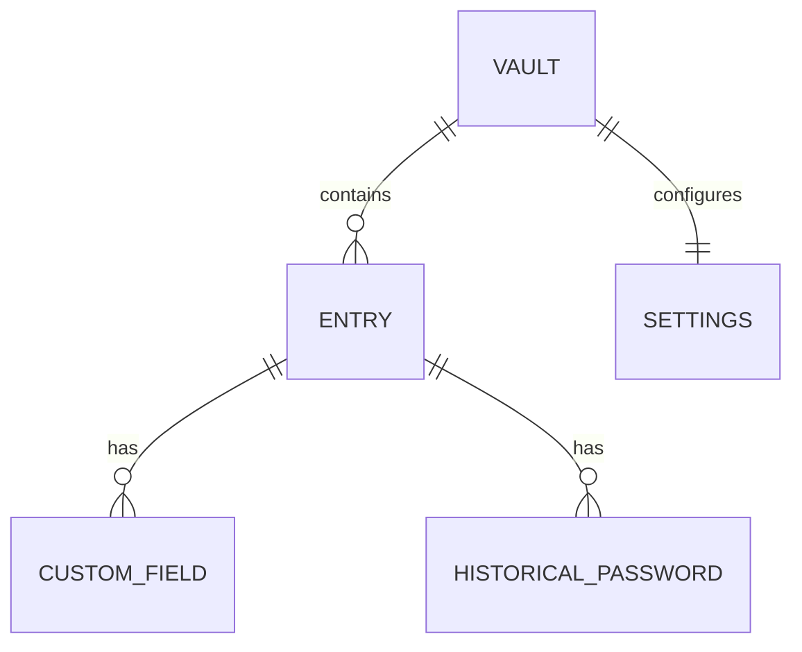

# Data Model & Schema Reference

Companion to [02-architecture.md §2.4.2](02-architecture.md). This is the authoritative schema
reference for the decrypted `VaultPayload` and the on-disk header. Types are Rust; `serde`
derives `Serialize`/`Deserialize` on all of them.

## Header (cleartext, `format.rs`)

| Field | Type | Size | Notes |
|---|---|---|---|
| `magic` | `[u8; 4]` | 4 B | `b"VKLT"` |
| `format_version` | `u16` | 2 B | Currently `1` |
| `kdf_id` | `u8` | 1 B | `1` = Argon2id |
| `kdf_salt` | `[u8; 16]` | 16 B | CSPRNG, generated once per vault |
| `kdf_m_cost_kib` | `u32` | 4 B | Default `262144` (256 MiB) |
| `kdf_t_cost` | `u32` | 4 B | Default `3` |
| `kdf_p_cost` | `u32` | 4 B | Default `1` |
| `keyfile_bound` | `u8` | 1 B | `0`/`1` |
| `aead_id` | `u8` | 1 B | `1` = XChaCha20-Poly1305 |
| `nonce` | `[u8; 24]` | 24 B | CSPRNG, regenerated every save |
| `header_crc` | `u32` | 4 B | CRC32 corruption sanity check only — **not** a security control (the AEAD tag is) |

## VaultPayload (encrypted plaintext)

```rust
struct VaultPayload {
    schema_version: u16,
    entries: Vec<Entry>,
    settings: Settings,
}

struct Entry {
    id: Uuid,                              // stable identifier, used in audit log
    title: String,                         // required, unique-by-convention (not enforced)
    username: Option<String>,
    password: SecretBox<str>,              // zeroized on drop, redacted Debug
    url: Option<String>,
    notes: Option<String>,
    tags: Vec<String>,
    totp_seed: Option<SecretBox<str>>,     // base32, RFC 4648
    custom_fields: Vec<CustomField>,
    password_history: Vec<HistoricalPassword>,
    created_at: DateTime<Utc>,
    updated_at: DateTime<Utc>,
}

struct CustomField { label: String, value: SecretBox<str>, sensitive: bool }
struct HistoricalPassword { value: SecretBox<str>, replaced_at: DateTime<Utc> }

struct Settings {
    kdf_params: KdfParams,                       // mirrors header, source of truth on rekey
    clipboard_clear_seconds: u32,                 // default 20
    session_idle_timeout_seconds: u32,            // default 300 (shell mode only)
    generator_defaults: GeneratorPolicy,
}

struct GeneratorPolicy {
    length: u16,            // default 20
    use_upper: bool,        // default true
    use_lower: bool,        // default true
    use_digits: bool,       // default true
    use_symbols: bool,      // default true
    avoid_ambiguous: bool,  // default true (excludes 0/O, 1/l/I, etc.)
}
```

## Audit log record (plaintext, append-only JSON Lines file)

```json
{"ts":"2026-08-13T10:15:03Z","op":"UNLOCK_SUCCESS","entry_id":null}
{"ts":"2026-08-13T10:15:07Z","op":"GET","entry_id":"5b1c...-uuid"}
{"ts":"2026-08-13T10:16:40Z","op":"ADD","entry_id":"7e2a...-uuid"}
```

`op` ∈ `{INIT, UNLOCK_SUCCESS, UNLOCK_FAILED, ADD, GET, EDIT, DELETE, EXPORT, IMPORT,
PASSWORD_CHANGED, REKEY, LOCK}`. **Never** contains `title`, `username`, `password`, `url`,
`notes`, or `totp_seed` — by construction (the audit module's public function signature only
accepts an `Uuid`, not an `Entry`, so a call site cannot accidentally pass secret data).

## Export/import format

`vaultkeep export` writes a file using the **same header+AEAD envelope** as the primary vault
(re-encrypted, optionally under a different password), so an export is just a portable vault
snapshot. A separate `--plaintext-json` export mode exists for interoperability/migration; it
requires the explicit flag `--i-understand-the-risk` and prints a prominent warning to stderr
before writing, and the audit log always records `EXPORT` regardless of mode.

## Entity-relationship summary



There is intentionally no cross-entry relational structure (no folders/hierarchies in the MVP —
`tags` provide flat categorization); this keeps the schema, the file format, and the CLI surface
simple, matching the local-first, single-user scope decided in Phase 1.
